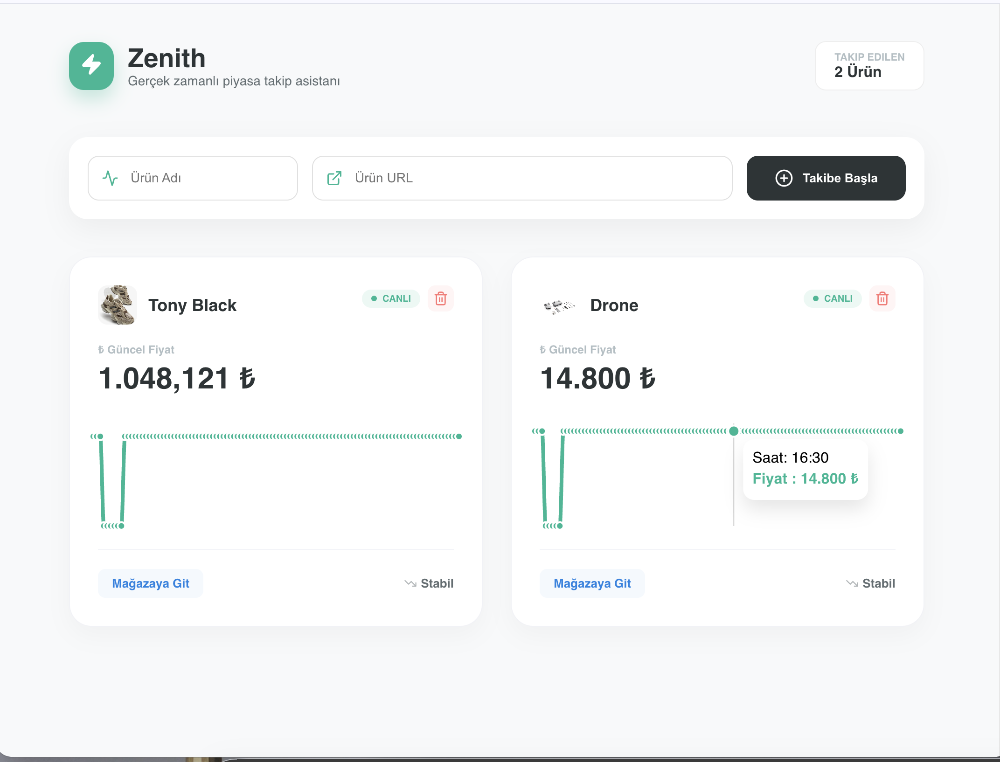

# 🚀 Zenith
**Minimalist & Gerçek Zamanlı Fiyat Takip Platformu**

Zenith, karmaşık e-ticaret platformlarında vakit kaybetmeden ilgilendiğiniz ürünlerin fiyatlarını saniyelik olarak izlemenizi sağlayan, minimalist çizgilerle tasarlanmış profesyonel bir fiyat takip platformudur.

---

## 📸 Uygulama Görünümü

---

## ✨ Özellikler
* **⚡ Canlı Fiyat Akışı:** Sayfayı yenilemeye gerek kalmadan fiyat değişimlerini anlık olarak izleyin.
* **🎯 İnce Solid Border UI:** net çizgilerle ayrılmış, beyaz kartlar ve ince çerçeveler ile profesyonel görünüm.
* **💹 Akıllı Piyasa Analizi:** Fiyatın "Düşüşte" veya "Stabil" olduğunu analiz eden renk kodlu sistem.
* **📉 Minimal Sparkline Grafikler:** Kart içinde yer alan sade çizgi grafiklerle fiyat trendini görün.

## 🛠️ Teknolojiler
* **Frontend:** React.js, Recharts, Lucide Icons
* **Backend:** Node.js, Express.js
* **Database:** PostgreSQL (Sequelize ORM)

## 🚀 Kurulum
1. `git clone https://github.com/kullanici-adin/zenith.git`
2. `npm install` (hem server hem client için)
3. `.env` dosyanıza veritabanı bilgilerinizi girin.
4. `npm run start` diyerek yayına alın.

